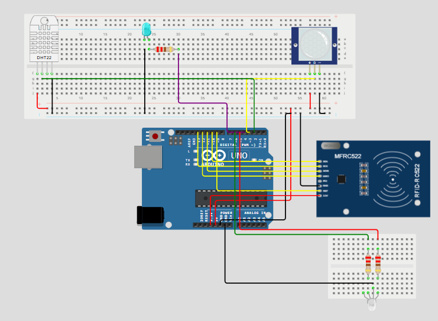
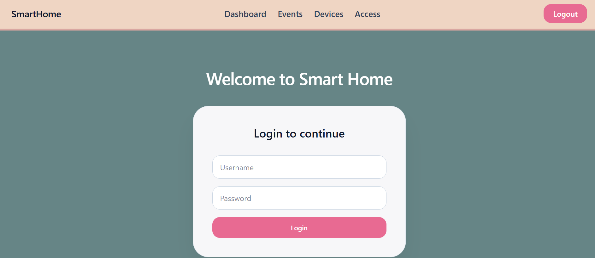
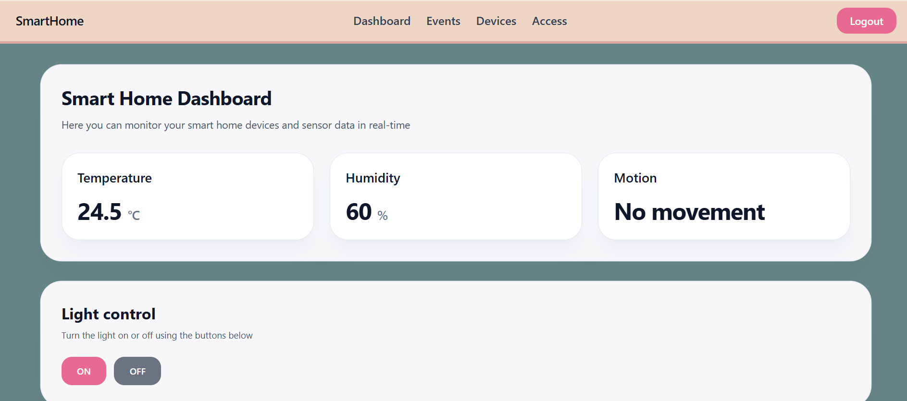
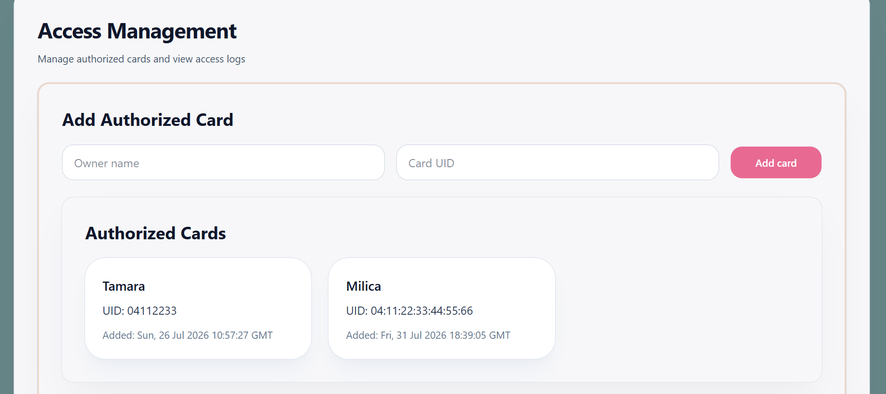

# IoT Smart Home System

A full-stack IoT smart home application developed as a university project for monitoring and controlling smart home devices through a web interface.

The system integrates a React frontend with a Python/Flask backend and supports communication with Arduino hardware through a serial connection. It can also run in simulation mode without a physical Arduino, allowing sensor readings, RFID access attempts and device interactions to be tested directly from the application.






## Features

* Real-time monitoring of temperature and humidity
* Motion detection and event logging
* RFID-based access control
* Management of authorized RFID cards
* Access history with granted and denied attempts
* Smart device overview
* Remote light control
* Smart home event history
* User registration and login
* Arduino serial communication
* Simulation mode for testing without physical hardware
* Automatic dashboard updates

## Technologies

### Frontend

* React
* JavaScript
* Vite
* Tailwind CSS
* Axios
* React Router

### Backend

* Python
* Flask
* Flask-SQLAlchemy
* SQLAlchemy
* REST API
* PySerial

### Database

* PostgreSQL
* SQLAlchemy ORM

### Hardware & IoT

* Arduino
* RFID reader
* Temperature and humidity sensors
* Motion sensor
* LED / light control
* Serial communication

## System Overview

The application consists of three main parts:

### React Web Application

The frontend provides a user interface for monitoring and controlling the smart home system.

It includes several main pages:

* **Dashboard** – displays current temperature, humidity and motion status
* **Devices** – shows devices connected to the smart home system
* **Access Management** – manages authorized RFID cards and displays access logs
* **Event History** – displays recent events recorded by the system
* **Login & Registration** – provides basic user authentication

Sensor information on the dashboard is periodically refreshed so that the interface displays the latest available readings.

### Flask Backend

The Flask REST API connects the frontend, database and IoT communication layer.

The backend provides endpoints for:

* devices
* sensor data
* RFID access control
* authorized cards
* smart home events
* light control
* user authentication

Data is stored through SQLAlchemy models.

The main stored entities include:

* users
* devices
* sensor readings
* authorized RFID cards
* access logs
* smart home events

### Arduino Communication Service

A separate Python service handles communication between the backend and Arduino.

The service can operate in two modes:

#### Hardware Mode

When a physical Arduino is connected, the service communicates with it through a serial port.

It can process data such as:

```text
TEMP:23.5,HUM:48.0,MOTION:1
```

and RFID card information received from the device.

The application can also send commands back to the Arduino, for example:

```text
LED_ON
LED_OFF
```

#### Simulation Mode

The application can run without a physical Arduino.

Simulation mode generates temperature, humidity and motion data automatically and allows RFID cards and Arduino commands to be tested through the backend.

This makes it possible to develop and demonstrate the complete application without requiring the hardware to be connected at all times.

## Sensor Monitoring

The system processes three main sensor values:

* **Temperature**
* **Humidity**
* **Motion**

Sensor readings are sent to the Flask API and stored in the database.

The React dashboard periodically requests the latest readings and displays them to the user.

When motion changes from inactive to active, the system generates a motion event.

## RFID Access Control

The system includes RFID-based access management.

RFID cards can be registered as authorized cards using:

* card UID
* owner's name

When a card is scanned, its UID is checked against the list of authorized cards.

Depending on the result, access is recorded as:

```text
GRANTED
```

or

```text
DENIED
```

The result is stored in the access log.

When Arduino hardware is used, the system can also send a visual response to the device:

* green signal for granted access
* red signal for denied access

## Event System

The application records important smart home events, including:

* motion detection
* RFID access attempts
* light activation
* light deactivation

The most recent events can be viewed through the Event History page.

## Light Control

The dashboard allows the user to control a light connected to the Arduino.

The React application sends a request to the Flask API, which forwards the appropriate command to the Arduino communication service.

Supported commands include:

```text
LED_ON
LED_OFF
```

In simulation mode, the commands are processed without requiring physical hardware.

## Project Structure

```text
IoT-SmartHome-System/
│
├── backend/
│   ├── app.py
│   ├── arduino_reader.py
│   ├── config.py
│   ├── database.py
│   ├── seed.py
│   │
│   ├── models/
│   │   ├── access_log.py
│   │   ├── authorized_card.py
│   │   ├── device.py
│   │   ├── event.py
│   │   ├── sensor_data.py
│   │   └── user.py
│   │
│   └── routes/
│       ├── access_routes.py
│       ├── auth_routes.py
│       ├── control_routes.py
│       ├── device_routes.py
│       ├── event_routes.py
│       └── sensor_routes.py
│
└── frontend/
    └── frontend/
        └── src/
            ├── components/
            ├── pages/
            │   ├── Access.jsx
            │   ├── Dashboard.jsx
            │   ├── Devices.jsx
            │   ├── Events.jsx
            │   ├── Login.jsx
            │   └── Register.jsx
            │
            ├── services/
            └── utils/
```

## Running the Project

### Prerequisites

Make sure you have installed:

* Python
* Node.js and npm
* PostgreSQL

Arduino hardware is optional because the system supports simulation mode.

### Backend Setup

Navigate to the backend directory:

```bash
cd backend
```

Create and activate a virtual environment:

```bash
python -m venv venv
```

Install dependencies:

```bash
pip install -r requirements.txt
```

Create a `.env` file and configure the database connection:

```text
DATABASE_URL=your_database_connection_string
```

Run the main Flask API:

```bash
python app.py
```

The main API runs on:

```text
http://127.0.0.1:5000
```

### Arduino Communication Service

Start the Arduino communication service:

```bash
python arduino_reader.py
```

It runs on:

```text
http://127.0.0.1:5001
```

By default, the project can be configured to use simulation mode, so a physical Arduino is not required for testing.

### Frontend Setup

Navigate to the frontend directory:

```bash
cd frontend/frontend
```

Install dependencies:

```bash
npm install
```

Start the development server:

```bash
npm run dev
```

## Academic Context

This project was developed as part of the **Internet of Things** course at the Faculty of Organizational Sciences, University of Belgrade.

The project demonstrates the integration of:

* IoT hardware and sensors
* serial communication
* REST APIs
* frontend and backend applications
* relational databases
* event monitoring
* access control
* hardware simulation

## Author

**Tamara Jerotijević**
